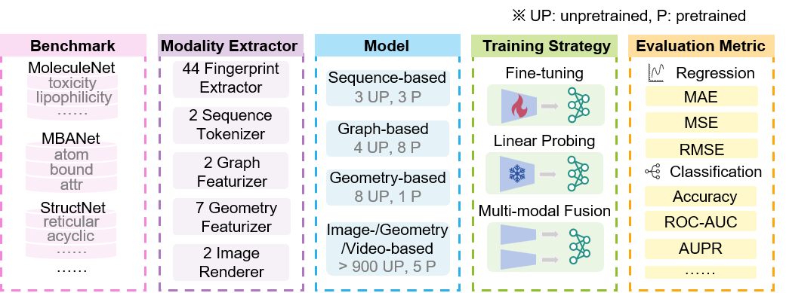

<p align="center"></p>

<h3 align="center">A Multi-Modality Benchmarking Platform For Molecular Representation</h3>

<h4 align="center">Supporting ADMET, QSAR, Virtual Screening and More</h4>

<div align="center">Built on PyTorch, benchmol is an easy-to-use and extensible Python package for drug discovery.</div>


<p align="center"></p>


# News !

- [2024/09/17] benchmol is released on GitHub.


# Features !

- Supports Property Prediction, ADMET, QSAR, Virtual Screening and More

- Supports 7 different modalities of molecules, including fingerprint, sequence, graph, geometry graph, image, geometry image, and video.

- Supports a large number of baselines for molecular data of different modalities.

- Two novel benchmarks: MBANet and StructNet.


# Benchmarks

BenchMol provides two new benchmarks, MBANet and StructNet.


## MBANet

| Name   | Link                                                         | Description                                                  |
| ------ | ------------------------------------------------------------ | ------------------------------------------------------------ |
| MBANet | [OneDrive](https://1drv.ms/f/c/53030532e7d1aed6/EkBJ5uQDm8ROn6v1V8W3N6QBM724K5y0xB5ZSjkq0rg8qg?e=71m9XB) | Complete MBANet data, including csv files of molecules and data of different modalities processed |


## StructNet

| Name                        | Link                                                         | Description                                                  |
| --------------------------- | ------------------------------------------------------------ | ------------------------------------------------------------ |
| Raw Data                    | [OneDrive](https://1drv.ms/x/c/53030532e7d1aed6/EY6PJMH6N-9DnGfTcIiL4yIBf2IQaRcO5bPOw4jGQ2HwKQ?e=vcPKj1) | > 10 million molecules from CHEMBL 34                        |
| Raw Data of StructNet       | [OneDrive](https://1drv.ms/f/c/53030532e7d1aed6/Eq40uAkAGLlGmzS4hrwqAn8ByuFMv9mUIVGkpcNVEIfDsw?e=d7Yjrl) | The original data of StructNet includes csv files of 60 datasets. |
| Processed Data of StructNet | [OneDrive](https://1drv.ms/u/c/53030532e7d1aed6/EXRGFKBXVCRLhaHS2hKenfEBsVT2Qb3_Ao8ipALK6b7ksw?e=NtbEqP) | Processed data, including geometry, image, video and other multi-modal data |


# Tutorials

We provide examples of using benchmol, please see below:


## Feature Extraction

The following shows a use case of extracting features from different modalities with benchmol:

| Description                                                  | Tutorial Links                                               |
| ------------------------------------------------------------ | ------------------------------------------------------------ |
| Extracting Molecular Fingerprints                            | [1_extract_fp_features.ipynb](./tutorials/1_extract_fp_features.ipynb) |
| Extracting features from sequence using un-pretrained CHEM-BERT | [1_extract_sequence_features.ipynb](./tutorials/1_extract_sequence_features.ipynb) |
| Extracting features from geometry image using IEM            | [1_extract_geometry_image_features.ipynb](./tutorials/1_extract_geometry_image_features.ipynb) |
| Extracting features from graph using GIN                     | [1_extract_graph_features.ipynb](./tutorials/1_extract_graph_features.ipynb) |
| Extracting features from molecular image using ImageMol      | [1_extract_image_features.ipynb](./tutorials/1_extract_image_features.ipynb) |
| Extracting features from video using VideoMol                | [1_extract_video_features.ipynb](./tutorials/1_extract_video_features.ipynb) |


## Linear Probing

Use case for linear probing is provided with benchmol: [2_linear_probing.ipynb](./tutorials/2_linear_probing.ipynb)


## Fine-tuning

Use case for fine-tuning is provided with benchmol: [3_fine_tuning.ipynb](./tutorials/3_fine_tuning.ipynb) 


# Reference

If you find our code or anything else helpful, please do not hesitate to cite the following relevant papers:

```xnl

```


# Acknowledge

